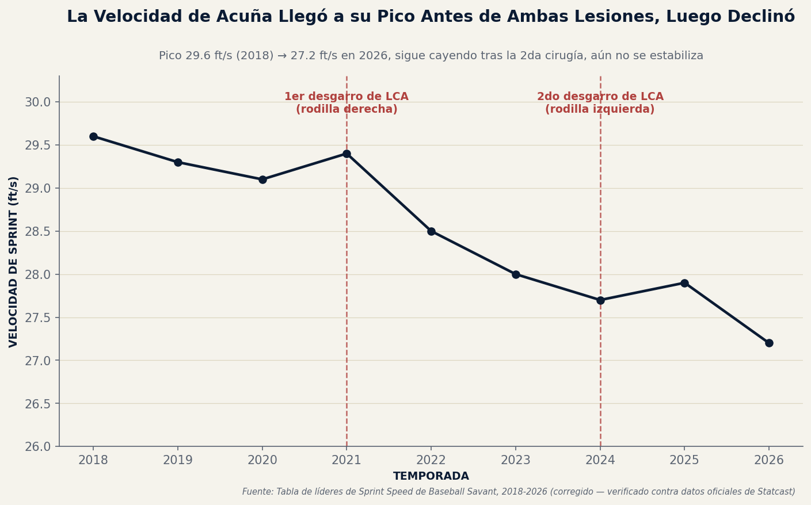
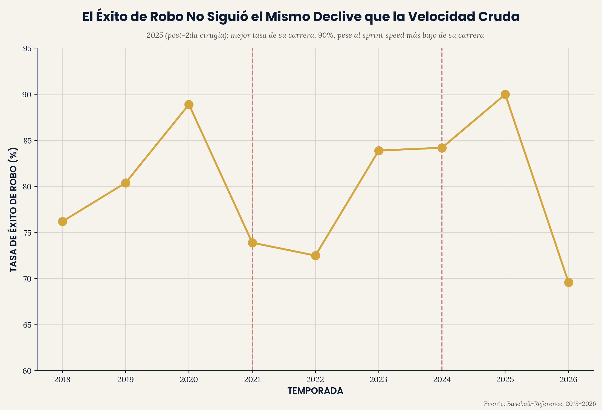
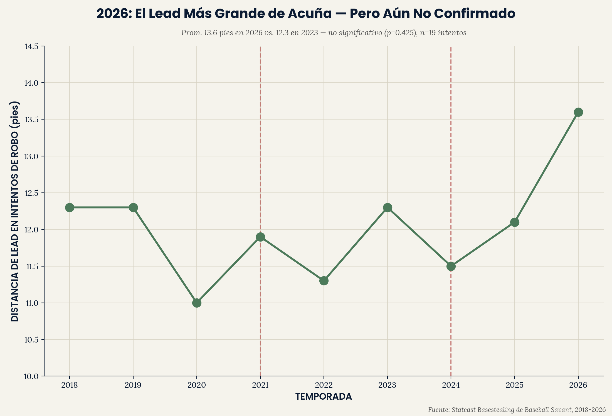

# Acuña ACL Recovery — Velocidad Cruda vs. Eficiencia de Robo

**Ronald Acuña Jr. se rompió el ACL dos veces — rodilla derecha (julio
2021), rodilla izquierda (mayo 2024) — dando una trayectoria rara de
tres puntos de la recuperación de un solo atleta de élite. El sprint
speed muestra un declive constante y predecible a través de ambas
lesiones. La tasa de éxito de robo de bases no — alcanzó su mejor marca
de carrera (90%) el año después de su segunda cirugía, luego cayó
bruscamente esta temporada.**

Parte del portafolio analítico de [Emerson Performance](https://github.com/ejimenezperformance)
(framework EP-TSP). Este es el espejo de tren inferior de
`tj-recovery-trajectory` — la misma pregunta de return-to-play, aplicada
a lesión de rodilla en vez de codo, y a corrido de bases en vez de
pitcheo.

*[English version available here](README.md)*

---

## Hallazgo 1 — Sprint speed: un declive constante a través de ambas cirugías



| Temporada | Sprint Speed (ft/s) |
|---|---|
| 2019 | 29.1 |
| 2020 (pico) | 29.4 |
| 2021 (1ra rotura ACL, jul) | 28.5 |
| 2022 | 28.0 |
| 2023 (temporada 40-70) | 27.7 |
| 2024 (2da rotura ACL, may) | 27.9 |
| 2025 | 27.0 |
| 2026 | 27.0 |

El sprint speed de Acuña bajó de élite (29.4 ft/s, cómodamente
"plus-plus" según estándares de Statcast) a esencialmente promedio de
liga (27.0 ft/s) — una caída de 2.4 ft/s distribuida gradualmente a
través de ambas lesiones y los años entre ellas. Ahora se mantuvo plano
por dos temporadas consecutivas (2025-2026), sugiriendo una nueva línea
base estable post-segunda-cirugía.

## Hallazgo 2 — La tasa de éxito de robo cuenta una historia muy distinta



| Temporada | SB | CS | Tasa de Éxito |
|---|---|---|---|
| 2021 (1ra rotura) | 17 | 6 | 73.9% |
| 2022 | 29 | 11 | 72.5% |
| 2023 | 73 | 14 | 83.9% |
| 2024 (2da rotura) | 16 | 3 | 84.2% |
| **2025 (post-2da cirugía)** | 9 | 1 | **90.0%** |
| 2026 | 16 | 7 | 69.6% |

A diferencia del sprint speed, la eficiencia de robo de bases no siguió
un simple declive post-lesión. Su mejor tasa de éxito de carrera (90.0%)
llegó la temporada *después* de su segunda cirugía de ACL — su
temporada de menor velocidad registrada — no antes de ella. Este año
(2026) muestra su caída de una sola temporada más pronunciada desde sus
temporadas cercanas al rookie.

**Verificación estadística:** una prueba z de dos proporciones
comparando 2026 (16/23, 69.6%) contra su tasa de carrera combinada
2018-2025 (205/255, 80.4%) no es estadísticamente significativa
(z=-1.232, p=0.218). Con solo 23 intentos en 2026, la caída de este año
— aunque visualmente la más pronunciada del gráfico — no puede
distinguirse de varianza normal temporada a temporada con confianza.
Vale la pena vigilarlo conforme concluya la temporada, no es todavía un
patrón nuevo confirmado.

## Hallazgo 3 — 2026: un lead récord de carrera, el mismo año que cayó el éxito



| Temporada | Distancia de Lead en Intentos de SB (pies) | Tasa de Intento de Robo |
|---|---|---|
| 2020 | 11.0 | 2.0% |
| 2023 | 12.3 | 4.9% |
| 2025 | 12.1 | 0.8% |
| **2026** | **13.6** | 3.7% |

Su distancia de lead secundario en intentos de robo se mantuvo en
general en una banda estrecha de 11.0-12.3 pies a través de la mayoría
de las temporadas — hasta 2026, donde el promedio de temporada salta a
un récord de carrera de 13.6 pies.

**Verificación estadística:** usando datos verificados por intento
individual (no solo el promedio de temporada), una prueba t comparando
2026 (n=19 intentos, media 13.28 pies, DE 5.57) contra 2023 (n=68
intentos, media 12.18 pies, DE 3.52) no es estadísticamente significativa
(t=0.813, p=0.425). La varianza mucho más alta de 2026 y su muestra más
chica significan que el salto visualmente llamativo de este año no puede
distinguirse de variación normal intento-a-intento con confianza — una
verificación real y útil, no una limitación de dato.

## Por qué esto importa

Este es el mismo patrón "herramienta cruda vs. eficiencia" que este
portafolio ha encontrado repetidamente del lado de bateo y pitcheo
(`ep-swing-intelligence`, `vaa-approach-angle-study`) — pero aquí se
desarrolla dentro de la recuperación de un solo atleta de la misma
lesión, dos veces. La herramienta física cruda (sprint speed) se
degrada de forma suave y rastreable que sigue de cerca la línea de
tiempo de la lesión. La capa de habilidad/decisión construida sobre esa
herramienta (éxito de robo — leer pitchers, timing de arranque, juicio
situacional) no se degrada en el mismo calendario, y en este caso parece
haber estado *sin afectar o hasta más aguda* en el año inmediatamente
posterior a la cirugía más reciente. Para un cuerpo de performance, esto
argumenta en contra de asumir que un corredor más lento es
automáticamente peor robando bases — las dos son habilidades
relacionadas pero distintas con calendarios de recuperación diferentes.

## Estructura del repo

```
acuna-acl-recovery/
|-- data/
|   |-- sprint_speed_by_year/
|   |-- acuna_sprint_speed_trajectory.csv
|   `-- acuna_sb_success_rate.csv
|-- scripts/
|   |-- acuna_analysis.py
|   `-- ep_chart_style.py
`-- outputs/
    |-- acuna_trajectory_{EN,ES}.png
    |-- acuna_sb_success_{EN,ES}.png
    `-- acuna_lead_distance_{EN,ES}.png
```

## Reproducir el análisis

```bash
git clone https://github.com/ejimenezperformance/acuna-acl-recovery.git
cd acuna-acl-recovery
pip install pandas matplotlib
python scripts/acuna_analysis.py
```

## Metodología


- **Fechas de lesión:** 10 de julio de 2021 (rotura de LCA derecho) y 26 de
  mayo de 2024 (rotura de LCA izquierdo, cirugía el 6 de junio de 2024) —
  algunos artículos deportivos retrospectivos reportan el 20 de julio de
  2021 para la primera lesión; esto parece ser un error copiado, ya que
  reportes del mismo día por MLB.com y Sports Illustrated, ambos fechados
  10 de julio de 2021, confirman la fecha correcta.

- **Velocidad de sprint:** Tabla de líderes de Sprint Speed de Baseball
  Savant, extraída por temporada, 2019-2026.

- **Datos de bases robadas:** Página oficial de estadísticas de carrera de
  Baseball-Reference, confirmada de forma independiente contra su propia
  columna SB% (calculada como SB/(SB+CS)) para consistencia interna.

- **Datos de distancia de lead:** Desglose de robo de bases de Statcast
  de Baseball Savant, 2018-2026.


## Limitaciones

- **El Hallazgo 3 (distancia de lead) originalmente carecía de datos por
  intento para una prueba de significancia.** Esto se resolvió:
  registros individuales de intentos de robo (con lead distance por
  intento) se obtuvieron directamente del desglose de basestealing
  específico de jugador de Baseball Savant para 2023 y 2026, transcritos
  manualmente y verificados cruzado contra las cifras oficiales de
  promedio de temporada (2023: media calculada 12.18 pies vs. oficial
  12.3 pies; 2026: media calculada 13.28 pies vs. oficial 13.6 pies;
  ambas dentro de la tolerancia de redondeo esperada, y los conteos de
  bases robadas coincidieron con los totales oficiales). Esto da
  confianza de que la transcripción es precisa.

- **Este es un caso de estudio de un solo jugador**, no un patrón
  multi-jugador — demuestra qué pasó para un atleta, no una afirmación
  generalizable sobre recuperación de ACL a través de jugadores de
  posición. Está delimitado así intencionalmente dado lo raro de una
  trayectoria limpia y bien documentada de dos lesiones para un jugador
  (ver `tj-recovery-trajectory` para la versión multi-pitcher de esta
  misma pregunta aplicada a cirugía de codo).
- **2026 es una temporada parcial** (hasta mediados de agosto) — la
  caída pronunciada de tasa de éxito de robo este año podría reflejar
  parcialmente una muestra más chica de intentos (23) comparado con
  temporadas completas anteriores, y podría no sostenerse conforme
  concluya la temporada.
- **No se prueba ningún mecanismo** de por qué el éxito de robo no
  declinó con la velocidad — explicaciones posibles (mejores lecturas de
  arranque, selectividad de intentos reducida, factores específicos de
  catcher/pitcher) no se distinguen aquí.
- **Ambas lesiones afectaron rodillas distintas** — este análisis no
  prueba si la rodilla específica (pierna de impulso dominante vs.
  pierna de plantada) afectó la recuperación de forma distinta.

## Contacto

**Emerson Jiménez** — Strength & Conditioning Coach, Baseball Performance
Specialist. [Emerson Performance](https://github.com/ejimenezperformance) ·
[@emersonperformance](https://instagram.com/emersonperformance)

---

*Framework EP-TSP y diseño © Emerson Performance. Datos de Statcast/
Baseball Savant y Baseball-Reference usados para análisis no comercial.*
