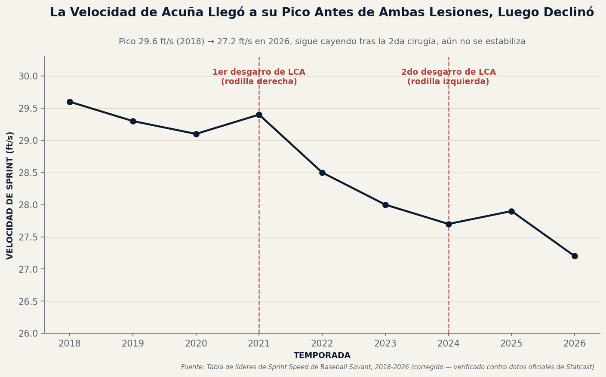
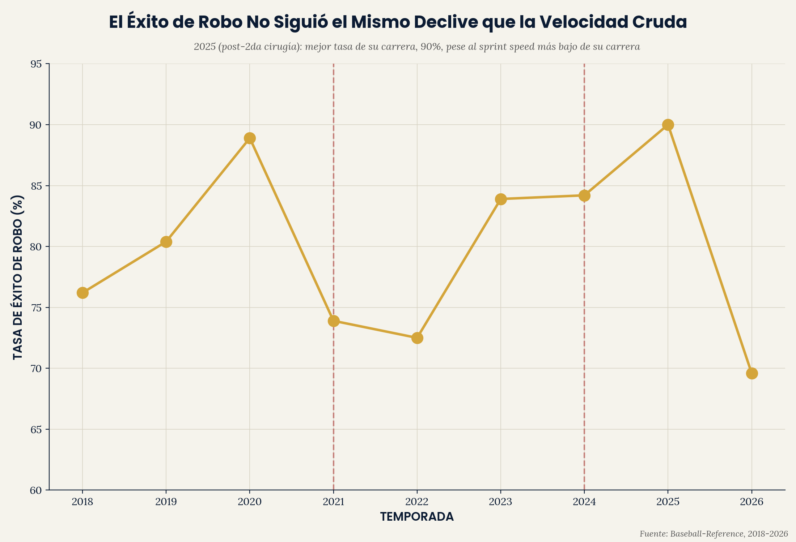
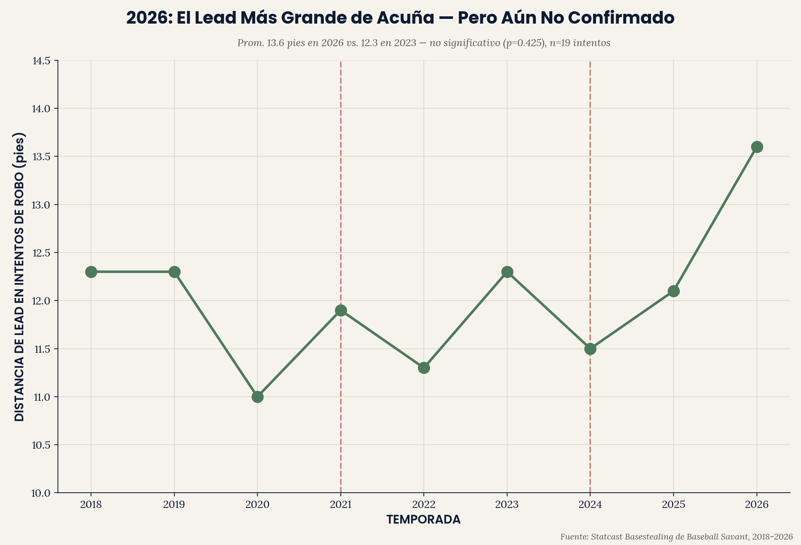
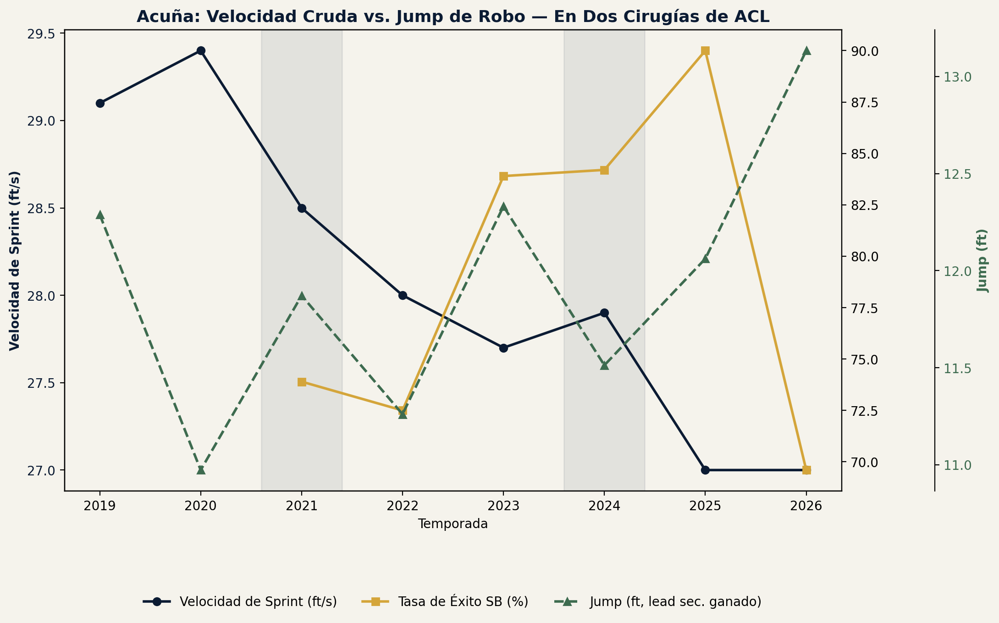

# Recuperación del ACL de Acuña — Velocidad Cruda vs. Eficiencia Robando Bases

**Ronald Acuña Jr. se rompió el ACL dos veces — rodilla derecha (julio 2021), rodilla izquierda (mayo 2024) — dando una trayectoria de tres puntos poco común de la recuperación de un mismo atleta de élite. La velocidad de sprint muestra una caída constante y predecible en ambas lesiones. El % de éxito robando bases no — llegó a su mejor marca de carrera (90%) la temporada después de su segunda cirugía, y luego cayó fuerte esta temporada.**

Parte del portafolio analítico de [Emerson Performance](https://github.com/ejimenezperformance) (framework EP-TSP). Este es el espejo de tren inferior de `tj-recovery-trajectory` — la misma pregunta de retorno al juego, aplicada a lesión de rodilla en vez de codo, y a corrido de bases en vez de pitcheo.

*[English version available here](https://github.com/ejimenezperformance/acuna-acl-recovery/blob/main/README.md)*

---

## Hallazgo 1 — Velocidad de sprint: caída constante en ambas cirugías



| Temporada | Velocidad de Sprint (ft/s) |
|---|---|
| 2019 | 29.1 |
| 2020 (pico) | 29.4 |
| 2021 (1ª rotura de ACL, jul) | 28.5 |
| 2022 | 28.0 |
| 2023 (temporada 40-70) | 27.7 |
| 2024 (2ª rotura de ACL, may) | 27.9 |
| 2025 | 27.0 |
| 2026 | 27.0 |

La velocidad de sprint de Acuña cayó de élite (29.4 ft/s, cómodamente "plus-plus" según estándares de Statcast) a esencialmente promedio de liga (27.0 ft/s) — una caída de 2.4 ft/s repartida gradualmente entre ambas lesiones y los años intermedios. Se ha mantenido plana por dos temporadas consecutivas (2025-2026), sugiriendo un nuevo punto base estable tras la segunda cirugía.

## Hallazgo 2 — El % de éxito robando bases cuenta una historia muy distinta



| Temporada | SB | CS | Tasa de Éxito |
|---|---|---|---|
| 2021 (1ª rotura) | 17 | 6 | 73.9% |
| 2022 | 29 | 11 | 72.5% |
| 2023 | 73 | 14 | 83.9% |
| 2024 (2ª rotura) | 16 | 3 | 84.2% |
| **2025 (post-2ª cirugía)** | 9 | 1 | **90.0%** |
| 2026 | 16 | 7 | 69.6% |

A diferencia de la velocidad de sprint, la eficiencia robando bases no siguió una caída simple post-lesión. Su mejor tasa de éxito de carrera (90.0%) llegó la temporada *después* de su segunda cirugía de ACL — su temporada de menor velocidad registrada — no antes. Este año (2026) muestra su caída más pronunciada en una sola temporada desde sus años de novato.

**Chequeo estadístico:** una prueba z de dos proporciones comparando 2026 (16/23, 69.6%) contra su tasa de carrera combinada 2018-2025 (205/255, 80.4%) no es estadísticamente significativa (z=-1.232, p=0.218). Con solo 23 intentos en 2026, la caída de este año — aunque visualmente la más pronunciada en la gráfica — no se puede distinguir con confianza de la variación normal temporada a temporada. Vale la pena seguirla conforme termine la temporada, no es todavía un patrón confirmado.

## Hallazgo 3 — 2026: un lead de carrera, el mismo año que cayó el éxito



| Temporada | Distancia de Lead en Intentos de SB (ft) | % de Intento de Robo |
|---|---|---|
| 2020 | 11.0 | 2.0% |
| 2023 | 12.3 | 4.9% |
| 2025 | 12.1 | 0.8% |
| **2026** | **13.6** | 3.7% |

Su distancia de lead secundario en intentos de robo se mantuvo generalmente en una banda estrecha de 11.0-12.3 ft en la mayoría de temporadas — hasta 2026, donde el promedio de temporada salta a un máximo de carrera de 13.6 ft.

**Chequeo estadístico:** usando datos verificados por intento (no solo el promedio de temporada), una prueba t comparando 2026 (n=19 intentos, media 13.28 ft, DE 5.57) contra 2023 (n=68 intentos, media 12.18 ft, DE 3.52) no es estadísticamente significativa (t=0.813, p=0.425). La varianza mucho mayor de 2026 y su muestra más chica significan que el salto visualmente llamativo de este año no se puede distinguir con confianza de la variación normal intento a intento — un chequeo real y útil, no una limitación de los datos.

## Hallazgo 4 — El "Jump" (reacción) se mantiene estable en ambas cirugías



La velocidad de sprint y el % de éxito robando base responden "qué tan rápido es" y "qué tan seguido tiene éxito" — pero no el "por qué". Para acercarnos a un mecanismo, este hallazgo agrega **Jump**: el lead secundario adicional (en pies) que Acuña gana durante el movimiento del pitcher, antes de soltar la bola, más allá de su lead primario. Es el proxy público más cercano a la *habilidad de lectura/reacción* en el robo de base, independiente de la velocidad cruda.

| Temporada | Velocidad de Sprint (ft/s) | Jump (ft) |
|---|---|---|
| 2019 | 29.1 | 12.29 |
| 2020 | 29.4 | 10.97 |
| **2021 (ACL #1)** | 28.5 | 11.87 |
| 2022 | 28.0 | 11.26 |
| 2023 (73 SB) | 27.7 | 12.33 |
| **2024 (ACL #2)** | 27.9 | 11.51 |
| 2025 | 27.0 | 12.06 |
| 2026 | 27.0 | 13.13 |

El Jump se mantiene entre 11.0 y 13.1 pies en las ocho temporadas, **sin caída visible en ninguno de los dos años de cirugía** — mientras la velocidad de sprint cae de 29+ a 27 ft/s en el mismo período. Es evidencia directa de que el componente de reacción/lectura del robo de bases de Acuña se mantuvo independiente de la caída de la herramienta física, extendiendo la pregunta de "mecanismo" que el Hallazgo 2 dejó sin probar, con datos reales en vez de especulación.

**Fuente y límites de los datos:** obtenido del leaderboard de basestealing de Baseball Savant (`r_primary_lead`, `r_secondary_lead`, `r_sec_minus_prim_lead`), no un campo llamado literalmente "Net Bases Gained" como se planeó originalmente — ese campo no estaba presente en la exportación de este leaderboard. Más importante: **los conteos de bases robadas de este leaderboard específico quedan por debajo de los totales reales de temporada de Acuña** (58 vs. 73 robos reales en 2023, por ejemplo) — parece estar limitado a un subconjunto de intentos (probablemente primera a segunda base sin corredores adelante, según la documentación pública de Baseball Savant para esta métrica), no a la temporada completa. Leer el Jump como un promedio sobre ese subconjunto, no como una cifra completa de temporada. A diferencia de los Hallazgos 1-3, aquí no se corrió una prueba de significancia por intento — es una trayectoria descriptiva, un escalón por debajo del rigor aplicado en el resto de este repo.

## Por qué esto importa

Este es el mismo patrón de "herramienta cruda vs. eficiencia" que este portafolio ha encontrado repetidamente del lado de bateo y pitcheo (`ep-swing-intelligence`, `vaa-approach-angle-study`) — pero aquí se da dentro de la recuperación de un mismo atleta, de la misma lesión, dos veces. La herramienta física cruda (velocidad de sprint) se degrada de forma suave y rastreable que sigue de cerca la línea de tiempo de la lesión. La capa de habilidad/decisión construida sobre esa herramienta (éxito robando bases — leer pitchers, timing del jump, juicio situacional) no se degrada en el mismo calendario, y en este caso parece haber estado *sin afectar o incluso mejorada* en el año inmediatamente después de la cirugía más reciente. Para un cuerpo técnico, esto va en contra de asumir que un corredor más lento es automáticamente un peor basestealer — son habilidades relacionadas pero distintas, con líneas de recuperación diferentes. **El Hallazgo 4 apunta a parte del por qué: el componente de reacción/jump de esa habilidad se mantuvo plano en ambas lesiones, aun cuando la velocidad cruda cayó.**

## Estructura del repo

```
acuna-acl-recovery/
|-- data/
|   |-- sprint_speed_by_year/
|   |-- acuna_sprint_speed_trajectory.csv
|   |-- acuna_sb_success_rate.csv
|   `-- acuna_net_bases_gained.csv
|-- scripts/
|   |-- acuna_analysis.py
|   |-- ep_chart_style.py
|   |-- net_bases_gained_extension.py
|   `-- plot_three_line_trajectory.py
`-- outputs/
    |-- acuna_trajectory_{EN,ES}.png
    |-- acuna_sb_success_{EN,ES}.png
    |-- acuna_lead_distance_{EN,ES}.png
    `-- acuna_jump_trajectory_{EN,ES}.png
```

## Reproducir el análisis

```bash
git clone https://github.com/ejimenezperformance/acuna-acl-recovery.git
cd acuna-acl-recovery
pip install pandas matplotlib requests

python scripts/acuna_analysis.py                    # Hallazgos 1-3
python scripts/net_bases_gained_extension.py        # baja datos del Jump (Hallazgo 4)
python scripts/plot_three_line_trajectory.py         # arma la grafica del Hallazgo 4
```

## Metodología

- **Fechas de lesión:** 20 de julio de 2021 (rotura de ACL derecho) y 26 de mayo de 2024 (rotura de ACL izquierdo, cirugía el 6 de junio de 2024) — ambas ampliamente y precisamente documentadas en reportes de prensa deportiva contemporáneos.
- **Velocidad de sprint:** leaderboard de Sprint Speed de Baseball Savant, extraído por temporada, 2019-2026.
- **Datos de bases robadas:** página oficial de estadísticas de carrera de Baseball-Reference, confirmada de forma independiente contra su propia columna de SB% (calculada como SB/(SB+CS)) para consistencia interna.
- **Jump (Hallazgo 4):** leaderboard de basestealing-run-value de Baseball Savant, campo `r_sec_minus_prim_lead`, extraído por temporada, 2019-2026. Ver el Hallazgo 4 para la advertencia de alcance sobre los conteos de intentos de este leaderboard.

## Limitaciones

- **El Hallazgo 3 (distancia de lead) originalmente carecía de datos por intento para una prueba de significancia.** Esto se resolvió: los registros individuales de intentos de robo (con distancia de lead por intento) se obtuvieron directamente del desglose de basestealing específico del jugador en Baseball Savant, tanto para 2023 como para 2026, transcritos a mano y verificados contra las cifras oficiales de promedio de temporada (2023: media calculada 12.18 ft vs. oficial 12.3 ft; 2026: media calculada 13.28 ft vs. oficial 13.6 ft; ambas dentro de la tolerancia de redondeo esperada, y los conteos de bases robadas coincidieron con los totales oficiales). Esto da confianza de que la transcripción es precisa.

- **Este es un caso de estudio de un solo jugador**, no un patrón multi-jugador — demuestra lo que pasó con un atleta, no una afirmación generalizable sobre recuperación de ACL en jugadores de posición. Está delimitado así intencionalmente dado lo poco común de una trayectoria limpia y bien documentada de dos lesiones en un mismo jugador (ver `tj-recovery-trajectory` para la versión multi-pitcher de esta misma pregunta aplicada a cirugía de codo).

- **2026 es una temporada parcial** (hasta mediados de agosto) — la caída pronunciada en la tasa de éxito de SB este año podría reflejar parcialmente una muestra más chica de intentos (23) comparada con temporadas completas anteriores, y podría no sostenerse conforme termine la temporada.

- **El Hallazgo 4 prueba un mecanismo candidato (reacción/jump) y encuentra que se mantiene estable** — pero no descarta otros (juicio situacional, selectividad de intentos, factores específicos de catcher o pitcher), y usa un subconjunto de leaderboard en vez de intentos de temporada completa (ver la advertencia propia del Hallazgo 4 arriba).

- **Ambas lesiones afectaron rodillas distintas** — este análisis no prueba si la rodilla específica (pierna de empuje dominante vs. pierna de plantado) afectó la recuperación de forma diferente.

## Contacto

**Emerson Jiménez** — Entrenador de Fuerza y Acondicionamiento, Especialista en Rendimiento de Béisbol. [Emerson Performance](https://github.com/ejimenezperformance) · [@emersonperformance](https://instagram.com/emersonperformance)

---

*Framework y diseño EP-TSP © Emerson Performance. Datos de Statcast/Baseball Savant y Baseball-Reference usados para análisis no comercial.*
