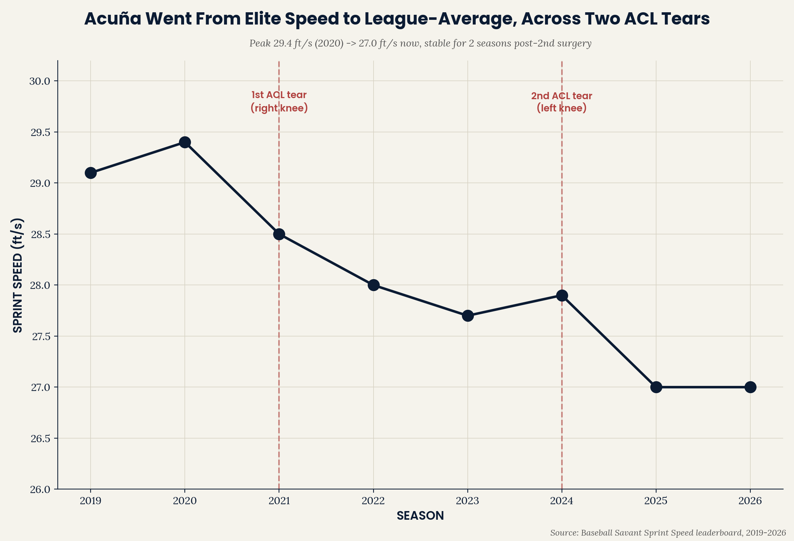
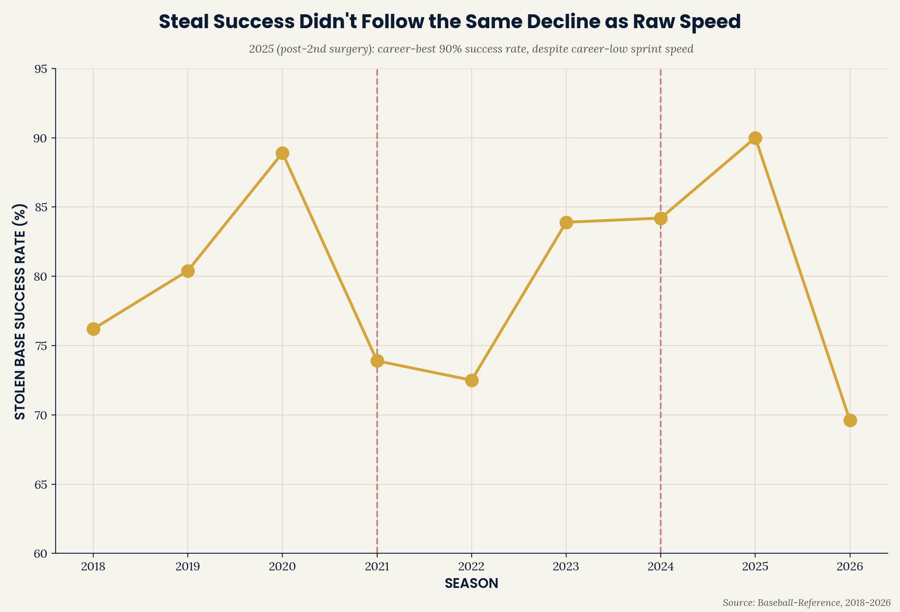
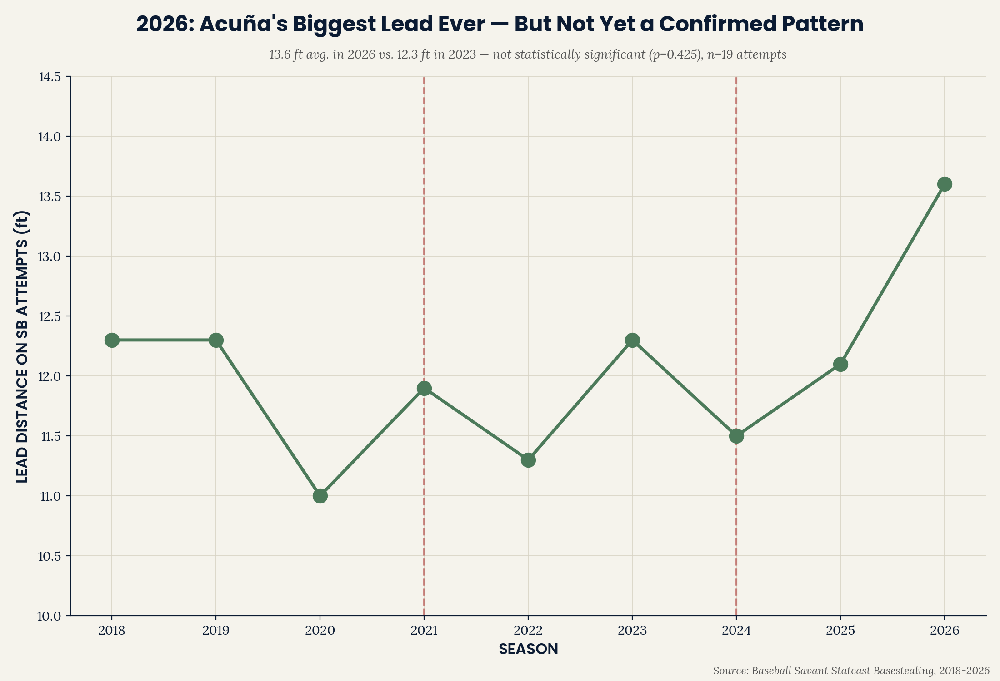

# Acuña ACL Recovery — Raw Speed vs. Stolen Base Efficiency

**Ronald Acuña Jr. tore his ACL twice — right knee (July 2021), left
knee (May 2024) — giving a rare three-point trajectory of a single
elite athlete's recovery. Sprint speed shows a steady, predictable
decline across both injuries. Stolen base success rate does not — it
hit a career-best 90% the year after his second surgery, then dropped
sharply this season.**

Part of the [Emerson Performance](https://github.com/ejimenezperformance)
analytics portfolio (EP-TSP framework). This is the lower-body mirror of
`tj-recovery-trajectory` — same return-to-play question, applied to knee
injury instead of elbow, and to baserunning instead of pitching.

*[Versión en español disponible aquí](README.es.md)*

---

## Finding 1 — Sprint speed: a steady decline across both surgeries



| Season | Sprint Speed (ft/s) |
|---|---|
| 2019 | 29.1 |
| 2020 (peak) | 29.4 |
| 2021 (1st ACL tear, Jul) | 28.5 |
| 2022 | 28.0 |
| 2023 (40-70 season) | 27.7 |
| 2024 (2nd ACL tear, May) | 27.9 |
| 2025 | 27.0 |
| 2026 | 27.0 |

Acuña's sprint speed has declined from elite (29.4 ft/s, comfortably
"plus-plus" by Statcast standards) to essentially league-average (27.0
ft/s) — a drop of 2.4 ft/s spread gradually across both injuries and the
years between them. It has now held flat for two consecutive seasons
(2025-2026), suggesting a new stable baseline post-second-surgery.

## Finding 2 — Stolen base success rate tells a very different story



| Season | SB | CS | Success Rate |
|---|---|---|---|
| 2021 (1st tear) | 17 | 6 | 73.9% |
| 2022 | 29 | 11 | 72.5% |
| 2023 | 73 | 14 | 83.9% |
| 2024 (2nd tear) | 16 | 3 | 84.2% |
| **2025 (post-2nd surgery)** | 9 | 1 | **90.0%** |
| 2026 | 16 | 7 | 69.6% |

Unlike sprint speed, stolen base efficiency did not track a simple
post-injury decline. His best-ever success rate (90.0%) came the season
*after* his second ACL surgery — his lowest-speed season on record — not
before it. This year (2026) shows his sharpest single-season drop since
his rookie-adjacent seasons.

**Statistical check:** a two-proportion z-test comparing 2026 (16/23,
69.6%) against his combined 2018-2025 career rate (205/255, 80.4%) is
not statistically significant (z=-1.232, p=0.218). With only 23 attempts
in 2026, this year's drop — while visually the sharpest on the chart —
cannot be distinguished from normal season-to-season variance with
confidence. It's worth watching as the season concludes, not yet a
confirmed new pattern.

## Finding 3 — 2026: a career-high lead, the same year success dropped



| Season | Lead Distance on SB Attempts (ft) | Steal Attempt % |
|---|---|---|
| 2020 | 11.0 | 2.0% |
| 2023 | 12.3 | 4.9% |
| 2025 | 12.1 | 0.8% |
| **2026** | **13.6** | 3.7% |

His secondary lead distance on stolen base attempts has generally
stayed in a tight 11.0-12.3 ft band across most seasons — until 2026,
where the season average jumps to a career-high 13.6 ft.

**Statistical check:** using verified per-attempt data (not just the
season average), a t-test comparing 2026 (n=19 attempts, mean 13.28 ft,
SD 5.57) against 2023 (n=68 attempts, mean 12.18 ft, SD 3.52) is not
statistically significant (t=0.813, p=0.425). 2026's much higher
variance and smaller sample size mean this year's visually striking
jump cannot be distinguished from normal attempt-to-attempt variation
with confidence — a real and useful check, not a data limitation.

## Why this matters

This is the same "raw tool vs. efficiency" pattern this portfolio has
found repeatedly on the hitting and pitching side (`ep-swing-intelligence`,
`vaa-approach-angle-study`) — but here it plays out inside a single
athlete's recovery from the same injury, twice. The raw physical tool
(sprint speed) degrades in a smooth, trackable way that closely follows
the injury timeline. The skill/decision layer built on top of that tool
(stolen base success — reading pitchers, jump timing, situational
judgment) does not degrade on the same schedule, and in this case
appears to have been *unaffected or even sharpened* in the year
immediately following the more recent surgery. For a performance staff,
this argues against assuming a slower runner is automatically a worse
basestealer — the two are related but distinct skills with different
recovery timelines.

## Repo structure

```
acuna-acl-recovery/
|-- data/
|   |-- sprint_speed_by_year/
|   |-- acuna_sprint_speed_trajectory.csv
|   `-- acuna_sb_success_rate.csv
|-- scripts/
|   |-- acuna_analysis.py
|   `-- ep_chart_style.py
`-- outputs/
    |-- acuna_trajectory_{EN,ES}.png
    |-- acuna_sb_success_{EN,ES}.png
    `-- acuna_lead_distance_{EN,ES}.png
```

## Reproduce the analysis

```bash
git clone https://github.com/ejimenezperformance/acuna-acl-recovery.git
cd acuna-acl-recovery
pip install pandas matplotlib
python scripts/acuna_analysis.py
```

## Methodology

- **Injury dates:** July 20, 2021 (right ACL tear) and May 26, 2024
  (left ACL tear, surgery June 6, 2024) — both widely and precisely
  documented in contemporaneous sports reporting.
- **Sprint speed:** Baseball Savant Sprint Speed leaderboard, pulled by
  season, 2019-2026.
- **Stolen base data:** Baseball-Reference official career statistics
  page, which independently confirmed against its own SB% column
  (calculated as SB/(SB+CS)) for internal consistency.

## Limitations

- **Finding 3 (lead distance) originally lacked per-attempt data for a
  significance test.** This was resolved: individual stolen-base-attempt
  records (with per-attempt lead distance) were obtained directly from
  Baseball Savant's player-specific basestealing breakdown for both 2023
  and 2026, manually transcribed and cross-verified against the
  official season-average figures (2023: calculated mean 12.18 ft vs.
  official 12.3 ft; 2026: calculated mean 13.28 ft vs. official 13.6 ft;
  both within expected rounding tolerance, and stolen-base counts
  matched the official totals). This gives confidence the transcription
  is accurate.

- **This is a single-player case study**, not a multi-player pattern —
  it demonstrates what happened for one athlete, not a generalizable
  claim about ACL recovery across position players. It is intentionally
  scoped this way given the rarity of a clean, well-documented two-injury
  trajectory for one player (see `tj-recovery-trajectory` for the
  multi-pitcher version of this same question applied to elbow surgery).
- **2026 is a partial season** (through mid-August) — the sharp SB
  success rate drop this year could partially reflect a smaller sample
  of attempts (23) compared to prior full seasons, and may not hold as
  the season concludes.
- **No mechanism is tested** for why stolen base success didn't decline
  with speed — possible explanations (better jump reads, reduced
  attempt selectivity, catcher/pitcher-specific factors) are not
  distinguished here.
- **Both injuries affected different knees** — this analysis does not
  test whether the specific knee (dominant push-off leg vs. plant leg)
  affected recovery differently.

## Contact

**Emerson Jiménez** — Strength & Conditioning Coach, Baseball Performance
Specialist. [Emerson Performance](https://github.com/ejimenezperformance) ·
[@emersonperformance](https://instagram.com/emersonperformance)

---

*EP-TSP framework and design © Emerson Performance. Statcast/Baseball
Savant and Baseball-Reference data used for non-commercial analysis.*
